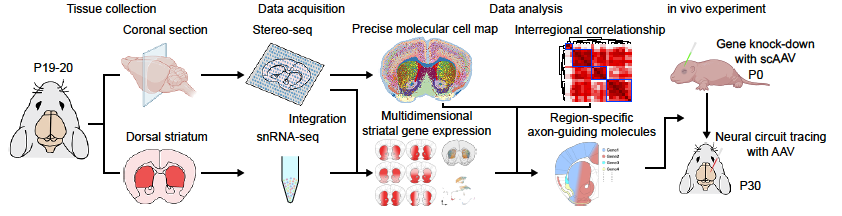

# Spatial transcriptomics and snRNA-seq reveal the cellular diversity and molecules establishing neuronal projection topography in mouse brain

Here is the code of our paper: **The Developmental Progress of Human Cerebellum Investigated by Multi-omics High-resolution Sequencing Technologies**

**If you have any questions, please contact us：**[**Our Lab**](http://english.genetics.cas.cn/people/faculty/index_20424.html?json=http://sourcedb.genetics.cas.cn/yw/people/peop/faculty/200907/t20090721_2130952.json)

## Table of Contents
- [Introduction](#introduction)
- [Dataset](#dataset)
- [Results](#results)
- [Acknowledgments](#acknowledgments)

## Introduction

The brain comprises a complex network of interconnected regions that serves as the central coordinator of cognition, movement, and emotion. For example, the limbic system, including the prelimbic cortex (PrL) and cingulate cortex (Cg), is critical for emotion regulation and decision-making. At the same time, the striatum is the vital component of the forebrain that integrates motivational, emotional, cognitive, and sensorimotor information. Distinct functions of various brain subregions are modulated by topographically organized inputs, highlighting the necessity of identifying specific cell types and associated neural circuits.

## Dataset
we identified 66888 bins (Bin50) in the Stereo-seq dataset with an average of 2376 genes per bin in P19 mice, and 7575 high-quality cells in the snRNA-seq datasets with an average of 3064 genes per cell in P20 mice.

## Results
we employed Stereo-seq, a spatial RNA sequencing based on in situ RNA capture, and single-nucleus sequencing (snRNA-seq) in the developing mouse brain. We revealed new molecular cell types and gene markers, in addition to providing a comprehensive and detailed spatial cell type composition. We uncovered the multi-dimensional patterns of gene expression in the striatum, as well as significant differences in biological processes and metabolic pathways among striatal subregions. Importantly, we identified multiple region-specific axon guidance genes, such as Sema7a, and constructed their regulatory networks across brain regions.

## Acknowledgments
We are grateful to everyone who has contributed to this project in various ways. Thank you!

